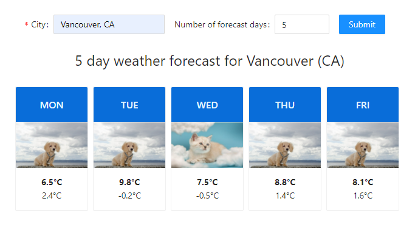

Tribe Weather App by Lucas
=========

<p align="center">
  
</p>

### To clone from gitHub:
```
$ git clone https://github.com/ldramowicz/tribe-weather-app.git
```

### Installation
To run this project, install it using npm:
```
$ cd tribe-weather-app
$ npm install
$ npm start
```
Finally, navigate to **http://localhost:3000** in browser

Note: You can click on the cat/dog image in the card to see the full-sized version

### API
* url - http://api.weatherbit.io/v2.0/forecast/daily
* example request - https://api.weatherbit.io/v2.0/forecast/daily?city=Vancouver,CA&days=5&key=API_KEY
* documentation- https://www.weatherbit.io/api/weather-forecast-16-day

### Objectives
For this assignment we would like you to build a weather forecast page.\
The user shall be able to search for a specific city. Once the city has been chosen, they will then be able to input the number of days into the future and the page will let the user know how the weather will be using pictures of cats and dogs.\
For example, if the weather on those days is raining show a picture of a wet cat. If the weather is good show a picture of a warm dog. If the weather is going to snow show a picture of cat in snow.


### Tech
To create the app I have used the following:
* React with create-react-app as template
* ant-design -> for page layout, cards and form elements
* moment.js -> for date formatting